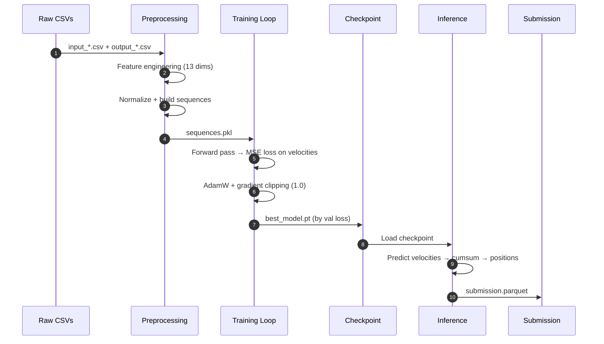

# NFL Big Data Bowl 2026 — Trajectory Prediction

[](https://github.com/damsolanke/NFL-bdb/actions/workflows/ci.yml)

Spatio-Temporal Graph Neural Network (STGNN) for predicting NFL player trajectories. Graph Attention Networks capture spatial player interactions while Transformer layers model temporal dynamics — velocity predictions are integrated into position trajectories at inference time.

## Architecture

```mermaid
%%{init: {'theme': 'base', 'themeVariables': {'primaryColor': '#E3F2FD', 'primaryTextColor': '#1565C0', 'primaryBorderColor': '#1565C0', 'lineColor': '#555', 'secondaryColor': '#FFF3E0', 'tertiaryColor': '#F3E5F5', 'fontSize': '14px'}}}%%
flowchart LR
    subgraph DATA["Data · 22 players per frame"]
        RAW[Tracking CSV<br/>x, y, speed, dir, ...]
        FE[Feature Engineering<br/>13 node features]
        SEQ[Sequence Builder<br/>100-frame windows]
    end

    subgraph MODEL["STGNN · PyTorch"]
        ENC[Node Encoder<br/>Linear → LayerNorm → GELU]
        GAT[GAT Layers ×3<br/>Multi-head attention]
        TF[Temporal Transformer ×4<br/>Positional encoding]
        REF[Refinement Block<br/>FFN + residual]
        HEAD[Output Head<br/>→ velocity ∆x, ∆y]
    end

    subgraph OUT["Inference"]
        VEL[Velocity Predictions]
        POS[Position Trajectories<br/>cumsum integration]
        SUB[Kaggle Submission<br/>Parquet output]
    end

    RAW --> FE --> SEQ --> ENC --> GAT --> TF --> REF --> HEAD --> VEL --> POS --> SUB

    style DATA fill:#E8F5E9,stroke:#2E7D32,stroke-width:2px,color:#1B5E20
    style MODEL fill:#E3F2FD,stroke:#1565C0,stroke-width:2px,color:#0D47A1
    style OUT fill:#F3E5F5,stroke:#6A1B9A,stroke-width:2px,color:#4A148C
```



### Model Components

| Component | Implementation | Purpose |
|-----------|---------------|---------|
| **Node Encoder** | `Linear(13, 256) → LayerNorm → GELU` | Project raw player features into latent space |
| **GAT Layers** (×3) | GATv2 with 8-head attention, dropout 0.1 | Capture spatial interactions between players within 20-yard radius |
| **Temporal Transformer** (×4) | Transformer encoder, learnable positional embeddings, pre-norm | Model temporal dynamics across 100-frame trajectory windows |
| **Refinement Block** | `FFN(256→512→256) + LayerNorm + residual` | Refine trajectory representations before output |
| **Output Head** | `Linear(256→512) → GELU → Linear(512→2)` | Predict per-frame velocity vectors (∆x, ∆y) |

### Graph Construction

Each frame is represented as a graph where:

| Element | Specification |
|---------|--------------|
| **Nodes** | 22 players, each with 13 features (x, y, speed, acceleration, direction, orientation, etc.) |
| **Edges** | Spatial proximity within 20-yard radius, with 4 edge features (distance, angle, relative velocity) |
| **Batching** | Custom collation handles variable graph sizes across frames |

### Training → Inference Pipeline



## Quick Start

```bash
git clone https://github.com/damsolanke/NFL-bdb.git
cd NFL-bdb
pip install -e ".[dev]"
```

```bash
# 1. Place training data in data/train/ (input_*.csv, output_*.csv)
# 2. Preprocess
python scripts/build_sequences.py

# 3. Train
python scripts/train.py --batch-size 32 --epochs 100

# 4. Evaluate
python scripts/eval.py --checkpoint models/best_model.pt

# 5. Generate submission
python scripts/submit.py --input data/test_sample/test_input.csv --output submission.parquet
```

## Configuration

All hyperparameters in `configs/default.py`:

| Parameter | Value | Category |
|-----------|-------|----------|
| **HIDDEN_DIM** | 256 | Model |
| **GRAPH_LAYERS** | 3 | Model |
| **TEMPORAL_LAYERS** | 4 | Model |
| **HEADS** | 8 | Model |
| **DROPOUT** | 0.1 | Model |
| **NODE_DIM** | 13 | Data |
| **EDGE_DIM** | 4 | Data |
| **MAX_FRAMES** | 100 | Data |
| **RADIUS** | 20.0 yards | Graph |
| **BATCH_SIZE** | 32 | Training |
| **LEARNING_RATE** | 1e-4 | Training |
| **EPOCHS** | 100 | Training |
| **GRAD_CLIP_NORM** | 1.0 | Training |
| **USE_AMP** | True | Training |

## Design Decisions

| Decision | Why | Tradeoff |
|----------|-----|----------|
| **GAT over GCN** | Attention weights learn which player interactions matter most — a defender closing in should have higher weight than a distant lineman | ~2× slower per layer; worth it for trajectory accuracy |
| **Velocity prediction over position** | Velocities are smoother and more learnable; positions recovered by cumulative sum at inference | Requires initial position at inference time; training doesn't need it |
| **Graph-based representation** | Player interactions are inherently relational — a graph captures the spatial structure a flat MLP cannot | More complex batching (custom collation function); handled by PyTorch Geometric-style API |
| **Pre-norm Transformers** | More stable training for deep models; gradient flow improves with LayerNorm before attention | Slightly different from original Transformer; better empirically |
| **20-yard spatial radius** | Balances capturing relevant interactions vs. noise from distant players | Fixed radius may miss long-range plays; configurable in `configs/default.py` |
| **Learnable positional embeddings** | More flexible than sinusoidal; can learn task-specific temporal patterns | Requires `max_len` to be fixed; set to 100 frames |

## CLI Commands

All commands available via `nfl-bdb` after `pip install -e .`:

```bash
nfl-bdb train   [--batch-size N] [--learning-rate LR] [--epochs N] [--device DEVICE]
nfl-bdb infer   [--checkpoint PATH] [--sequences PATH] [--output PATH]
nfl-bdb eval    [--checkpoint PATH] [--sequences PATH] [--batch-size N]
nfl-bdb submit  [--input PATH] [--output PATH]
```

## Project Structure

```
├── configs/                      # Hyperparameter configuration
│   └── default.py                #   All model, training, and data params
├── src/nfl_bdb/                  # Main package
│   ├── models/                   #   STGNNRefine, GATLayer, TemporalTransformer
│   ├── training/                 #   Training loop with AMP + gradient clipping
│   ├── inference/                #   Prediction pipeline + dataset loading
│   ├── evaluation/               #   Model evaluation metrics
│   ├── preprocessing/            #   Feature engineering, normalization, sequence building
│   └── utils/                    #   GraphFeatures dataclass, graph builder, collation
├── scripts/                      #   CLI entry scripts (train, infer, eval, submit)
├── tests/                        #   Model + utility tests
├── notebooks/                    #   Preprocessing validation, model training
├── docs/                         #   Project overview, development guide, usage
├── .github/workflows/ci.yml      #   CI pipeline
├── pyproject.toml                #   Package metadata + dependencies
└── LICENSE                       #   MIT
```

## Testing

```bash
pytest tests/ -v
```

Tests cover model initialization, forward pass (training + inference modes), graph construction, and utility functions.

## License

MIT — see [LICENSE](LICENSE).

## Acknowledgments

- [NFL Big Data Bowl 2026](https://www.kaggle.com/competitions/nfl-big-data-bowl-2026) competition
- PyTorch team for the deep learning framework
